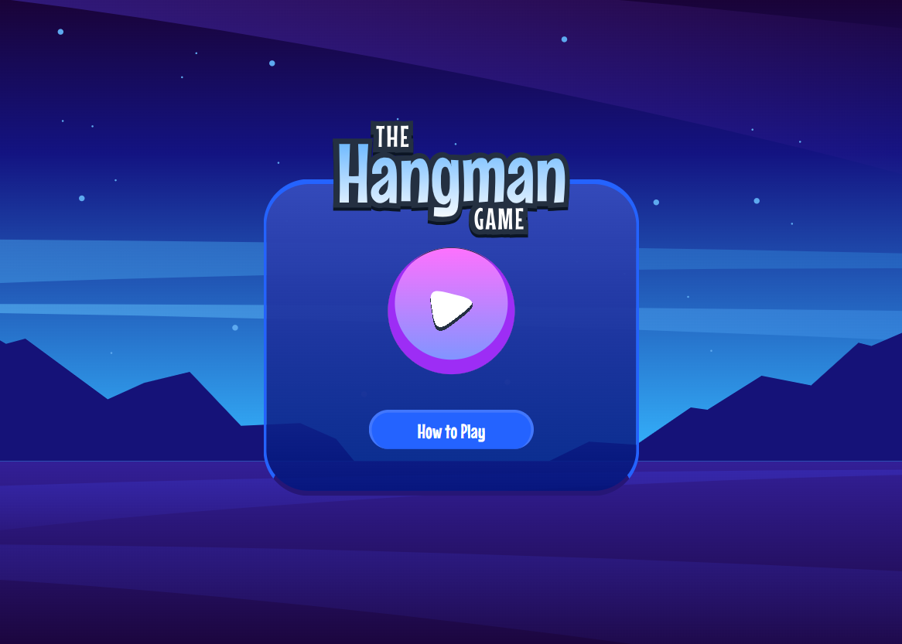
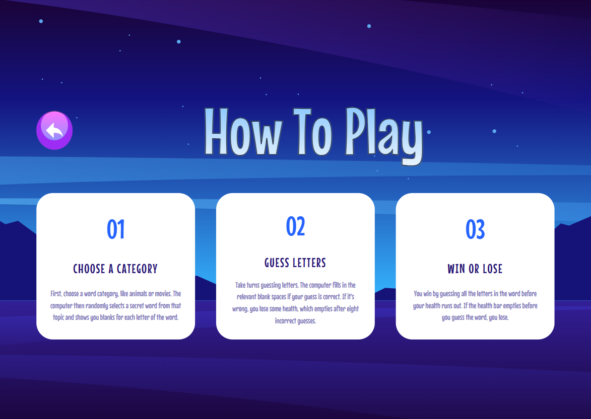
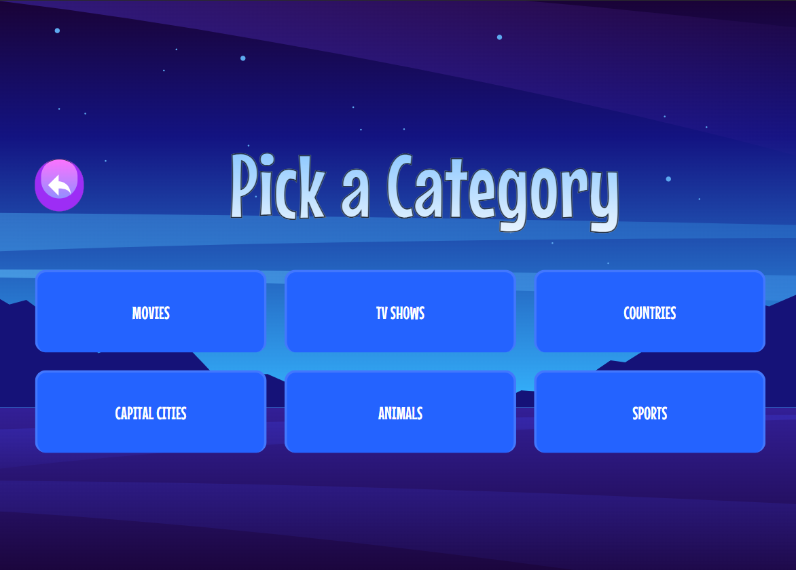
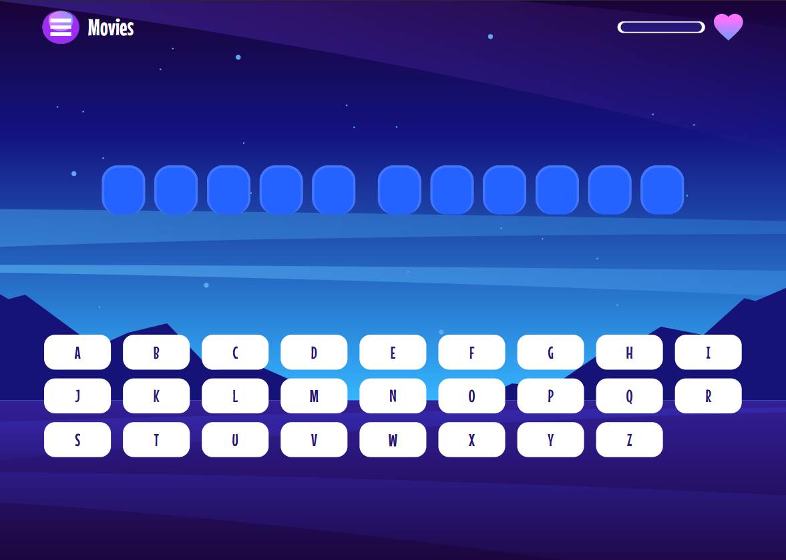
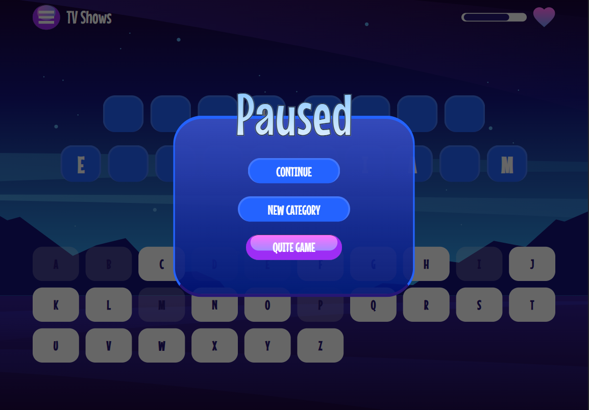
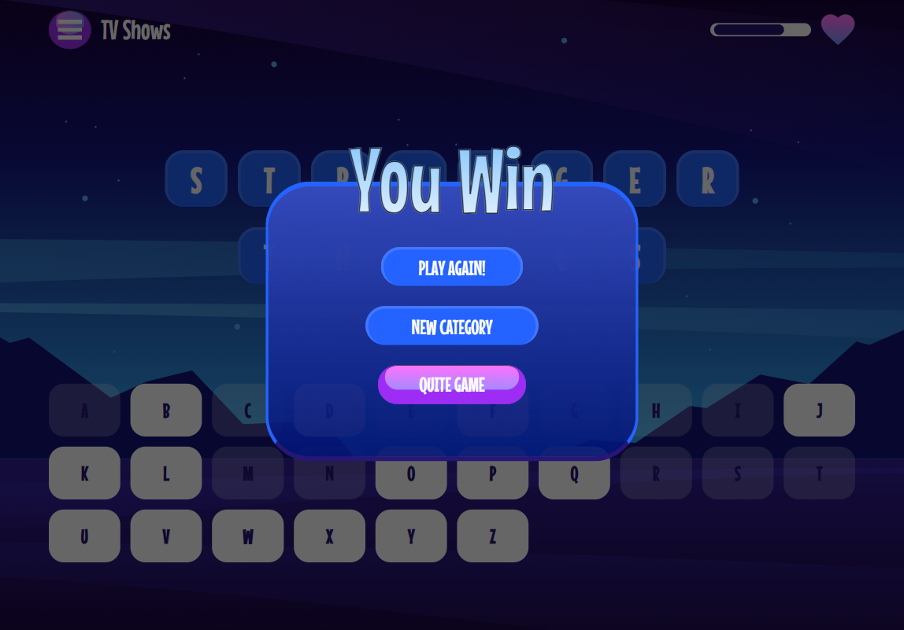
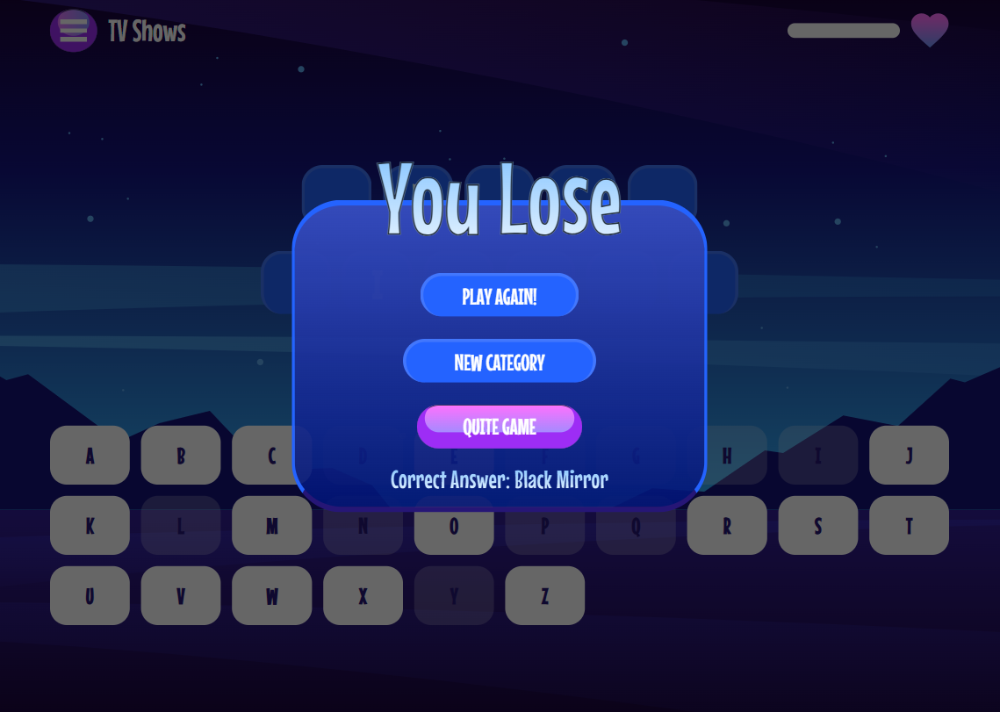

# Frontend Mentor - Hangman game solution

This is a solution to the [Hangman game challenge on Frontend Mentor](https://www.frontendmentor.io/challenges/hangman-game-rsQiSVLGWn). Frontend Mentor challenges help you improve your coding skills by building realistic projects.

## Table of contents

- [Overview](#overview)
  - [The challenge](#the-challenge)
  - [Screenshot](#screenshot)
  - [Links](#links)
- [My process](#my-process)
  - [Built with](#built-with)
  - [What I learned](#what-i-learned)
  - [Continued development](#continued-development)
- [Author](#author)
- [Acknowledgments](#acknowledgments)

## Overview

### The challenge

Users should be able to:

- Learn how to play Hangman from the main menu.
- Start a game and choose a category.
- Play Hangman with a random word selected from that category.
- See their current health decrease based on incorrect letter guesses.
- Win the game if they complete the whole word.
- Lose the game if they make eight wrong guesses.
- Pause the game and choose to continue, pick a new category, or quit.
- View the optimal layout for the interface depending on their device's screen size.
- See hover and focus states for all interactive elements on the page.
- Navigate the entire game only using their keyboard.

### Screenshot

Home


Rules



Categories



Game Board



Paused



Win



Lose



### Links

- Solution URL: [Add solution URL here](https://your-solution-url.com)
- Live Site URL: [live site URL](https://maduanusi-hangman-game.vercel.app/)

## My process

### Built with

- Semantic HTML5 markup
- CSS custom properties
- Flexbox
- CSS Grid
- Mobile-first workflow
- [React](https://reactjs.org/) - JS library
- [react-router-dom](https://reactjs.org/) - For routing
- [Tailwind](https://tailwind.com/) - For styles

### What I learned

Don't update a state using conditional rendering it will cause react infinite loop of component re-render instead use an effect hook with dependency based on a the state update or you leave in blank so it can run one if that want you want.

To see how you can add code snippets, see below:

```js
useEffect(() => {
  // filter the array with an empty string (' ')
  let pickedNewArray = picked
    .toLowerCase()
    .split("")
    .filter((pickedVlaue) => {
      if (pickedVlaue !== " ") {
        return pickedVlaue;
      }
    });

  let newArr = []; // new arr for correct guessed array
  picked
    .toLowerCase()
    .split("")
    .map((pickedVlaue) => {
      if (guessedLetters.includes(pickedVlaue)) {
        newArr.push(pickedVlaue);

        // equate both the new correct array and the filter picked array
        if (newArr.join("") === pickedNewArray.join("")) {
          setWinLosePause("you win");
          setOnWinLosePause(true);
        }
      }
    });

  // Lose game
  if (scores === 0) {
    setWinLosePause("you lose");
    setOnWinLosePause(true);
  }
}, [guessedLetters, picked, scores]);
```

### Continued development

Learn more React hooks


## Author

- Website - [maduanusi](https://maduanusi.vercel.app/)
- Frontend Mentor - [@therealmaduanusi](https://www.frontendmentor.io/profile/therealmaduanusi)
- Twitter - [@madu_anusi](https://www.twitter.com/madu_anusi)

## Acknowledgments

Firstly Frontend Mentor(FMC) for creating such challenge, me for taking it on and lastly the internet